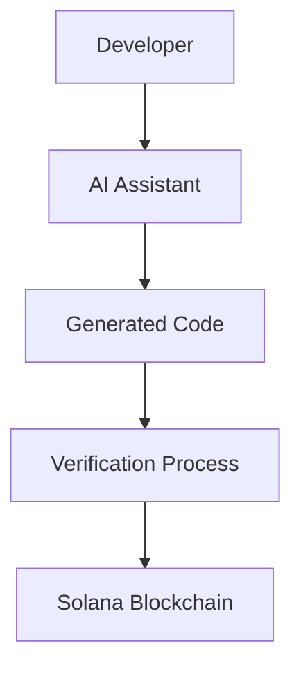

# Solana Bootcamp Notes – AI‑Assisted Learning Methodology

---

## Lesson Overview

This lesson explains **how AI should be used during the Solana developer bootcamp**. The goal is not to replace learning with AI‑generated code, but to use AI as a tool that accelerates technical understanding.

Instead of spending long periods searching documentation or forums, AI can help diagnose errors, explain concepts, generate scaffolding, and suggest implementation plans. However, without structure, AI can create a false sense of progress—where code runs but the developer does not understand why.

This section introduces a structured learning loop: **Design → Check → Verify → Build**. The methodology ensures developers remain actively engaged with the architecture and logic behind Solana programs.

By the end of this lesson, you understand how to:

- Use AI responsibly while learning Solana
- Debug faster using AI
- Avoid common pitfalls of AI‑generated code
- Verify on‑chain behavior instead of trusting local output

---

## Learning Objectives

- Understand the role of AI in accelerating developer learning
- Learn the "Design → Check → Verify → Build" workflow
- Identify common AI‑assisted development mistakes
- Learn how exercises in the bootcamp are structured
- Understand the gradual reduction of AI support during the course

---

## Key Solana Concepts

### AI‑Assisted Development

**Definition**  
Using AI tools to help generate explanations, debugging insights, and code scaffolding while learning programming.

**Purpose**  
To reduce friction in learning complex systems like Solana while maintaining developer understanding.

**How It Works**  
Developers provide context such as code snippets, errors, or architecture questions. AI suggests explanations or solutions which the developer must evaluate.

**Real Example**

A developer encounters a transaction simulation error:

```
Transaction simulation failed: Error processing Instruction 0
```

Instead of searching multiple sources, they paste the error and surrounding code into AI to quickly identify the root cause.

---

### Verification Loop

**Definition**  
A structured workflow ensuring AI output is validated rather than blindly executed.

**Purpose**  
Prevents developers from running code they do not understand.

**How It Works**

1. Design architecture decisions
2. Generate or write code
3. Check outputs
4. Verify results on-chain

**Real Example**

After deploying a program, a developer confirms:

- Program ID exists on Solana Explorer
- PDA account state matches expectations

---

### On‑Chain Verification

**Definition**  
Confirming program results using the blockchain itself rather than relying only on terminal output.

**Purpose**  
Solana programs ultimately run on-chain, so the blockchain is the **source of truth**.

**How It Works**

After deployment or transactions, developers inspect:

- Solana Explorer
- Program logs
- Account data

**Real Example**

A deployed program ID is pasted into Solana Explorer to confirm that the program exists on devnet.

---

## Why This Exists in Solana

Solana development introduces several complexities:

- Programs run on-chain
- State lives in accounts
- PDAs derive deterministic addresses
- Transactions contain multiple instructions

Because of this architecture, developers must **understand system design**, not just syntax.

AI can generate code quickly, but without understanding:

- Account ownership
- signer requirements
- PDA derivation

programs will fail or become insecure.

The structured learning approach ensures developers build **mental models of Solana architecture** rather than copying code.

---

## Mental Model

Think of AI as a **technical research assistant**, not the engineer.

```
Developer Brain
     |
Design Decisions
     |
AI Assistant
     |
Generated Explanation / Code
     |
Developer Verification
     |
Solana Blockchain
```

Flow explanation:

1. The developer defines the problem.
2. AI provides possible solutions.
3. The developer evaluates correctness.
4. The blockchain verifies reality.

---

## Architecture Diagram



This diagram illustrates the learning loop where the developer remains the decision-maker.

---

## Anchor / Program Structure

Although this lesson does not implement a specific program, it prepares developers to understand the structure used in later exercises.

Typical Anchor programs contain:

### Program Module

The Rust module defining instructions executed on-chain.

### Instruction Handlers

Functions that process instructions sent in transactions.

### Context Structs

Define the accounts required for each instruction.

### Account Structs

Data stored inside Solana accounts.

### PDA Derivation

Deterministic account addresses derived from seeds.

### Seeds and Bump

Used to generate unique PDA addresses.

### Constraints

Anchor account validation rules.

---

## Code Walkthrough

Example CLI verification command used during setup:

```bash
rustc --version && solana --version && anchor --version && surfpool --version && node --version && yarn --version
```

**What it does**

Runs multiple toolchain version checks in one command.

**Why it is needed**

Most Solana development issues originate from mismatched tool versions.

**Common mistakes**

- Missing Anchor installation
- Incorrect Solana CLI version
- Node or Yarn not installed

---

## Developer Cheat Sheet

### Command

```bash
solana config set --url devnet
```

**Purpose**

Switches the CLI environment to Solana devnet.

---

### Command

```bash
anchor build
```

**Purpose**

Compiles the Anchor program.

---

### Command

```bash
anchor deploy
```

**Purpose**

Deploys the compiled program to the Solana network.

---

### Command

```bash
anchor test
```

**Purpose**

Runs integration tests for the program.

---

## Step‑by‑Step Build Logic

Typical bootcamp workflow:

1. Install toolchain
2. Verify CLI versions
3. Create Anchor project
4. Write program instructions
5. Build program
6. Deploy to devnet
7. Run tests
8. Inspect results on Explorer

Each step reinforces understanding of Solana’s architecture.

---

## Common Errors & Fixes

| Error | Cause | Fix |
|-----|-----|-----|
| `solana: command not found` | CLI not installed or PATH missing | reinstall CLI and update PATH |
| Anchor build fails | Rust toolchain mismatch | reinstall Rust toolchain |
| Transaction simulation failed | incorrect accounts or signer | verify account constraints |
| Program ID mismatch | wrong deployment configuration | rebuild and redeploy program |

---

## Verification Checklist

Confirm the following after each exercise:

- Program successfully deployed
- Program ID visible on Solana Explorer
- Test transactions execute successfully
- Expected account state exists

---

## Security Notes

Developers should always validate:

- Signer permissions
- Account ownership
- PDA seeds
- State transition logic

Common mistakes include trusting client input without verification.

---

## AI Learning Prompts

1. Explain how Solana accounts differ from Ethereum storage.
2. Show an example of PDA derivation using seeds.
3. Explain Anchor account constraints with examples.
4. Why must Solana programs verify account ownership?
5. Explain transaction simulation errors in Solana.
6. Compare PDAs with normal accounts.
7. Show a secure counter program in Anchor.
8. Explain CPI with a practical example.
9. What happens internally during `anchor deploy`?
10. How does Solana Explorer retrieve program state?

---

## Mini Cheat Sheet Summary

### Core Concepts

- AI‑assisted learning
- Verification loop
- On‑chain validation

### Important Commands

- `anchor build`
- `anchor deploy`
- `anchor test`

### Important Patterns

- Always verify on-chain
- Understand code before running

### Common Pitfalls

- Blindly trusting AI output
- Skipping verification steps

---

## Personal Learning Notes

-
-
-
