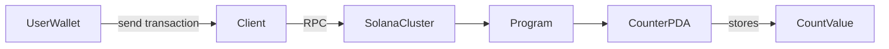

# Solana Bootcamp Notes – From Template to On‑Chain Program & Counter PDA

## Lesson Overview
This lesson walks through the transition from a freshly generated **Anchor template** to a **real deployed Solana program**. It covers the full developer loop:

- Build a program
- Deploy it to **devnet**
- Run integration tests
- Verify transactions and accounts on **Solana Explorer**
- Implement a **stateful PDA-based counter program**

The goal is not only to make the program run, but to understand **how Solana programs manage state, derive deterministic accounts, and verify behavior on-chain**.

---

# Learning Objectives
After completing this lesson you should be able to:

- Initialize a new Anchor project
- Build and deploy a Solana program
- Run TypeScript integration tests
- Inspect program artifacts on Solana Explorer
- Design a PDA-based account model
- Implement `initialize` and `increment` instructions
- Derive and verify PDAs between client and program
- Diagnose common Solana deployment errors

---

# Key Solana Concepts

## 1. Anchor Framework

### Definition
Anchor is a framework for writing Solana programs in Rust with a structured development workflow.

### Purpose
It simplifies:

- account validation
- serialization
- instruction handling
- testing

### How It Works
Anchor generates boilerplate code and enforces patterns using macros.

Example program entry:

```rust
#[program]
pub mod hello_solana {
    use super::*;

    pub fn initialize(ctx: Context<Initialize>) -> Result<()> {
        Ok(())
    }
}
```

### Example

```
anchor init hello_solana
```

Creates a full Solana program workspace including Rust program and TypeScript tests.

---

## 2. Program Derived Address (PDA)

### Definition
A **Program Derived Address** is a deterministic account address generated from seeds and a program ID.

### Purpose
Allows programs to control accounts **without needing private keys**.

### How It Works

PDAs are derived using:

```
seeds + program_id + bump
```

Client example:

```ts
const [pda] = PublicKey.findProgramAddressSync(
  [Buffer.from("counter"), user.publicKey.toBuffer()],
  program.programId
);
```

### Example Use Case

Each user has their **own counter account** derived from:

```
["counter", user_pubkey]
```

---

## Why This Exists in Solana

Solana programs are **stateless executables**.

All persistent data must live in **accounts**.

PDAs solve several problems:

- deterministic account discovery
- secure program-controlled accounts
- predictable state architecture

Without PDAs developers would need to store addresses manually or rely on private keys.

---

# Mental Model

Think of Solana as a system with:

- programs (logic)
- accounts (data)

Programs modify account data through instructions.

```
User → Transaction → Program Instruction → Account State Change
```

---

# Architecture Diagram



---

# Anchor Program Structure

Typical project layout:

```
hello_solana/

Anchor.toml
programs/
  hello_solana/
    src/lib.rs

tests/
  hello_solana.ts

migrations/

package.json
```

### Important Files

**Anchor.toml**

Project configuration including cluster and program IDs.

**programs/*/lib.rs**

Main Rust program logic.

**tests/**

TypeScript integration tests that interact with the deployed program.

---

# Code Walkthrough

## Counter Account

```rust
#[account]
pub struct Counter {
    pub authority: Pubkey,
    pub count: u64,
}
```

Explanation:

- `authority` → owner of the counter
- `count` → stored counter value

---

## Initialize Instruction

Creates the PDA account.

```rust
pub fn initialize(ctx: Context<Initialize>) -> Result<()> {
    let counter = &mut ctx.accounts.counter;

    counter.count = 0;
    counter.authority = ctx.accounts.user.key();

    Ok(())
}
```

---

## Increment Instruction

Updates the stored state.

```rust
pub fn increment(ctx: Context<Increment>) -> Result<()> {
    let counter = &mut ctx.accounts.counter;

    counter.count += 1;

    Ok(())
}
```

---

# Developer Cheat Sheet

### Create project

```
anchor init hello_solana
```

### Build

```
anchor build
```

### Deploy

```
anchor deploy
```

### Run tests

```
anchor test
```

### Check cluster

```
solana config get
```

---

# Step-by-Step Build Logic

### Step 1

Create project

```
anchor init hello_solana
```

### Step 2

Compile program

```
anchor build
```

### Step 3

Deploy to devnet

```
anchor deploy
```

Output will print a **Program ID**.

### Step 4

Run tests

```
anchor test
```

Tests execute transactions against the deployed program.

### Step 5

Verify on Explorer

Search the **Program ID** on:

```
https://explorer.solana.com
```

---

# Common Errors & Fixes

## Account already in use

Cause:

`initialize` called twice for same PDA.

Fix:

Ensure tests don't re-create the same PDA.

---

## Seeds constraint was violated

Cause:

Seed mismatch between client and program.

Fix:

Ensure seeds are identical in:

- program
- instruction
- client derivation

---

## Insufficient funds

Cause:

Devnet wallet has no SOL.

Fix:

```
solana airdrop 2
```

---

## AccountNotInitialized

Cause:

Calling `increment` before `initialize`.

Fix:

Ensure initialization happens first.

---

## Transaction simulation failed

Cause:

- missing signer
- incorrect accounts

Fix:

Check simulation logs and account metas.

---

# Verification Checklist

### Exercise 1

- `solana config get` points to **devnet**
- `anchor build` succeeds
- `anchor deploy` prints program ID
- `anchor test` passes
- Program visible on Explorer

### Exercise 2

- Counter PDA initialized
- Increment updates count
- PDA owner = program ID
- Account data exists
- Client derived PDA matches on-chain PDA

---

# Security Notes

Important checks:

- enforce `authority` validation
- confirm PDA seeds
- verify signer requirements
- avoid duplicate account creation

Always review:

- account constraints
- seed consistency
- space allocation

---

# AI Learning Prompts

Useful prompts for AI assistance.

### Debug installation

```
I ran anchor build on Ubuntu WSL and got this error:

[paste full error]

Explain the cause and fix.
```

### Explain Anchor files

```
Explain the purpose of:

Anchor.toml
programs/lib.rs
tests/*.ts
```

### Code walkthrough

```
Explain each line of this Anchor test file and how
accounts and instructions map to the program.
```

---

# Mini Cheat Sheet Summary

Anchor Workflow

```
init → build → deploy → test → verify
```

PDA Pattern

```
seeds + program_id + bump
```

Common Debugging Strategy

1. Check seeds
2. Check signer
3. Check account initialization
4. Inspect Explorer

---

# Personal Learning Notes

(Add your own notes here)

- 
- 
- 

